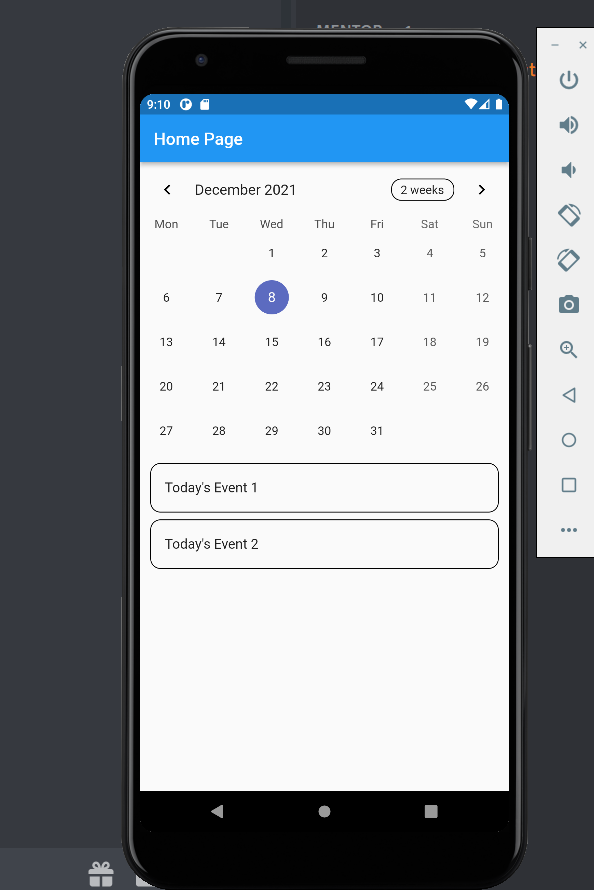
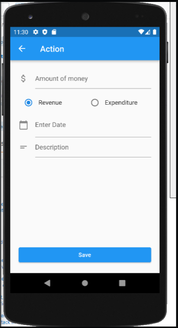

# final_project_devfest

Save Money - Final Project DevFest HCMC 2021

Save Money là một project giúp quản lý chi tiêu cho người dùng. 
## Các chức năng:
### Đăng nhập/ Đăng ký : sử dụng firebase để làm authenticattion
### Xem hoạt động chi tiêu : sử dụng calendar để ghi lại các mục thu chi
### Tạo mẫu thu chi: một form để tạo khoản thu chi

## 
## Các Views:

Màn hình chính Hiển thị danh sách các khoản thu/chi theo ngày được thể hiện trên lịch. Chọn vào lịch để xem các khoản thu chi

Màn hình tạo thu chi, để thêm các khoản thu và chi.